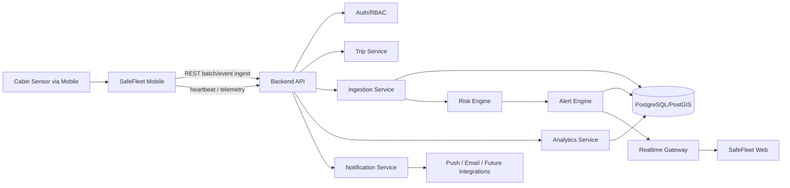
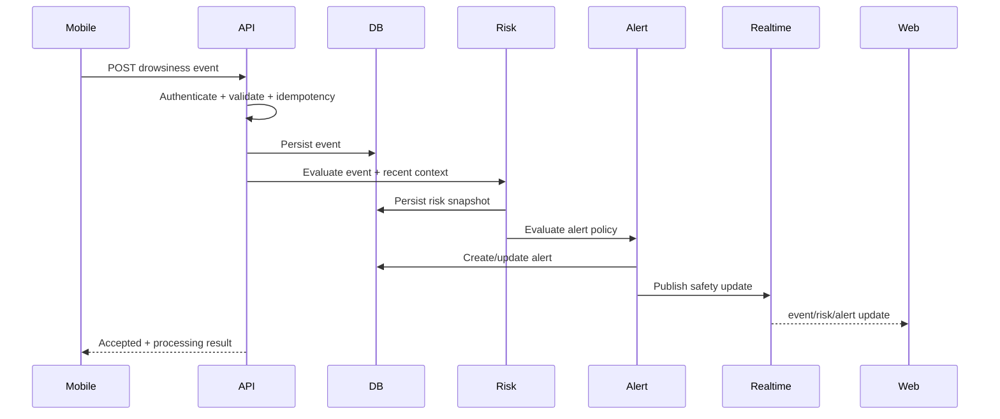

# SafeFleet AI Backend

Backend platform for **SafeFleet AI**, an integrated real-time driver and fleet safety system. The backend receives safety events from the mobile driver application, stores and correlates telemetry, calculates operational risk, distributes real-time alerts to the fleet web dashboard, and provides historical analytics for safety intervention.

> **Project status:** specification / pre-implementation. The requirements and features below describe the target backend contract; they do not imply that the modules are already implemented.

## Product Scope

SafeFleet AI is designed as a three-part system:

1. **SafeFleet Mobile** — driver-side Android application for camera-based drowsiness monitoring, local warning, location capture, device telemetry, and optional cabin sensor integration.
2. **SafeFleet Backend** — centralized API, data, real-time event, risk, alert, analytics, and integration layer described in this repository.
3. **SafeFleet Web** — fleet safety dashboard for supervisors and fleet managers.

The backend is **not** the primary mechanism that wakes or warns the driver. Immediate driver alarms must remain available locally on the mobile device even when the network or backend is unavailable. The backend adds fleet-level monitoring, escalation, historical context, and organizational intervention.

---

## Core Backend Objectives

The backend must:

- authenticate users, mobile devices, and services;
- manage organizations, fleets, drivers, vehicles, assignments, and trips;
- receive GPS, device, and operational telemetry from mobile clients;
- receive drowsiness events generated by on-device computer vision;
- receive optional cabin safety / gas sensor readings;
- convert individual events into fleet-level safety information;
- calculate configurable operational risk and safety status;
- generate, deduplicate, escalate, acknowledge, and resolve alerts;
- stream important updates to the web dashboard in real time;
- preserve event history for investigation and analytics;
- support research-oriented metrics such as false alarms, detection latency, time-to-alert, model version, and threshold profile;
- enforce tenant isolation, role-based authorization, auditability, and privacy controls.

---

## Source-Derived Safety Signals

The mobile application may send the following derived safety indicators to the backend:

### Driver drowsiness indicators

- EAR — Eye Aspect Ratio
- MAR — Mouth Aspect Ratio
- PERCLOS — percentage of eye closure over an observation window
- blink count / blink rate
- eye-closure duration
- yawning event and yawning duration
- head pose: pitch, yaw, roll
- drowsiness score generated by the mobile application
- alert level / local alarm status

### Cabin safety indicators

The system may optionally integrate cabin sensors such as:

- CO
- CO2
- VOC
- hydrocarbon or other configured gas measurements
- sensor health / connection state
- cabin safety status

The backend must treat sensor types and units as configuration-driven data rather than assume that every vehicle has the same sensors.

### Operational context

- driver ID
- vehicle ID
- active trip ID
- event timestamp
- GPS latitude / longitude
- speed, when available and legally/technically appropriate
- mobile battery level
- network status
- device/app version
- AI/model version
- threshold/calibration profile
- inference latency and optional quality metadata

---

# Functional Requirements

## FR-01 — Authentication and Identity

The backend shall support authenticated access for mobile, web, and service clients.

Required capabilities:

- JWT/OAuth-compatible authentication;
- access token validation on protected endpoints;
- refresh/session handling through the selected identity provider;
- user profile endpoint;
- device registration and revocation;
- service-to-service credentials for trusted integrations;
- role-based access control.

Recommended roles:

| Role | Primary access |
|---|---|
| `platform_admin` | platform administration and cross-tenant operational support |
| `org_admin` | organization, users, fleets, policies, and reports |
| `fleet_manager` | fleet-wide monitoring, analytics, and configuration |
| `supervisor` | live monitoring, alerts, intervention workflow |
| `driver` | own profile, active trip, own event/trip history where allowed |
| `service` | restricted machine-to-machine ingestion/integration access |

All business queries must be tenant-scoped. A user in one organization must never access another organization's fleet data unless explicitly authorized at platform level.

---

## FR-02 — Organization and Fleet Management

The backend shall manage:

- organizations;
- fleets;
- fleet membership;
- vehicles;
- drivers;
- driver-to-vehicle assignment;
- supervisor-to-fleet assignment;
- active/inactive status;
- metadata required for operational reporting.

Core rules:

- one organization may contain multiple fleets;
- one fleet may contain multiple vehicles and drivers;
- assignments must have effective timestamps;
- historical assignments must not be overwritten because incident history depends on them.

---

## FR-03 — Mobile Device Registration

Each driver mobile installation shall be represented as a registered device.

Store at minimum:

- device UUID generated by the application;
- driver/user association;
- platform and OS version;
- app version;
- optional device model;
- push-notification token where applicable;
- first-seen and last-seen timestamps;
- active/revoked status.

The backend must support revoking a lost, compromised, or decommissioned device.

---

## FR-04 — Trip Lifecycle

The backend shall support a trip lifecycle:

```text
CREATED -> ACTIVE -> COMPLETED
                 -> CANCELLED
                 -> ABORTED
```

Required operations:

- start trip;
- associate driver, vehicle, device, and fleet;
- receive periodic heartbeat;
- update latest location;
- end trip;
- recover from mobile offline periods;
- reject impossible duplicate active-trip states or resolve them deterministically.

A trip is the main correlation boundary for telemetry, drowsiness events, sensor events, alerts, and analytics.

---

## FR-05 — Telemetry Ingestion

The backend shall accept mobile telemetry in both single-event and batch form.

Example telemetry fields:

```json
{
  "event_id": "uuid",
  "trip_id": "uuid",
  "captured_at": "2026-09-17T03:30:00.000Z",
  "location": {
    "lat": -6.0,
    "lng": 106.0,
    "accuracy_m": 8.4
  },
  "speed_kph": 42.5,
  "battery_percent": 76,
  "network_type": "4g",
  "app_version": "0.1.0"
}
```

Requirements:

- client-generated `event_id` for idempotency;
- preserve both `captured_at` and server `received_at`;
- validate coordinates and data types;
- tolerate out-of-order mobile uploads;
- support offline queue replay;
- batch ingestion to reduce network and battery cost;
- prevent duplicate rows when the mobile client retries.

---

## FR-06 — Drowsiness Event Ingestion

Drowsiness inference is expected to happen primarily on the mobile device for the MVP. The backend receives **derived measurements and safety events**, not continuous raw camera video.

Example event contract:

```json
{
  "event_id": "uuid",
  "trip_id": "uuid",
  "driver_id": "uuid",
  "vehicle_id": "uuid",
  "captured_at": "2026-09-17T03:31:12.120Z",
  "event_type": "DROWSINESS",
  "severity": "WARNING",
  "metrics": {
    "ear": 0.19,
    "mar": 0.61,
    "perclos": 0.34,
    "eye_closure_ms": 1800,
    "blink_rate_per_min": 11,
    "yawning": true,
    "head_pitch_deg": 18.2,
    "head_yaw_deg": 3.1,
    "head_roll_deg": 1.5,
    "drowsiness_score": 0.78
  },
  "inference": {
    "model_version": "driver-monitor-v1",
    "threshold_profile": "default-v1",
    "inference_latency_ms": 37,
    "confidence": 0.91
  },
  "location": {
    "lat": -6.0,
    "lng": 106.0
  },
  "local_alarm_triggered": true
}
```

The backend shall:

- validate schema and ownership;
- apply idempotency;
- store the original normalized metrics;
- correlate the event with the active trip;
- compute fleet-level risk context;
- create or update an alert when policy conditions are satisfied;
- publish the event to authorized real-time subscribers;
- preserve model and calibration metadata for later analysis.

No fixed EAR, MAR, PERCLOS, or drowsiness threshold is defined by this backend specification. Thresholds must be configurable and validated against the actual mobile implementation and study protocol.

---

## FR-07 — Cabin Sensor Ingestion

Cabin safety measurements shall use an extensible sensor contract.

Example:

```json
{
  "event_id": "uuid",
  "trip_id": "uuid",
  "captured_at": "2026-09-17T03:31:15.000Z",
  "sensor_id": "cabin-sensor-01",
  "readings": [
    {
      "type": "CO",
      "value": 12.4,
      "unit": "ppm"
    },
    {
      "type": "VOC",
      "value": 0.42,
      "unit": "ppm"
    }
  ]
}
```

Requirements:

- generic sensor type/value/unit model;
- sensor registration and health state;
- timestamp and source tracking;
- configurable threshold rules;
- stale-sensor detection;
- optional correlation with driver drowsiness and trip risk.

Safety thresholds for toxic gases must come from the selected hardware specification and validated safety policy; they must not be invented or hardcoded without an approved source.

---

## FR-08 — Safety Event Normalization

Different input sources shall be normalized into a common `safety_event` domain model.

Suggested event categories:

- `DROWSINESS`
- `PROLONGED_EYE_CLOSURE`
- `YAWNING`
- `HEAD_NOD`
- `DRIVER_CAMERA_UNAVAILABLE`
- `SENSOR_GAS_THRESHOLD`
- `SENSOR_DISCONNECTED`
- `TELEMETRY_LOST`
- `DEVICE_LOW_BATTERY`
- `MANUAL_SOS` — optional future feature

Each safety event should contain:

- unique event ID;
- tenant/fleet/driver/vehicle/trip references;
- source;
- event type;
- severity;
- captured and received timestamps;
- location when available;
- normalized payload;
- source/model/version metadata;
- processing status.

---

## FR-09 — Risk Engine

The backend shall provide a configurable risk engine that transforms isolated events into operational safety context.

Risk computation may consider:

- current drowsiness score;
- repeated drowsiness events within a time window;
- prolonged eye closure;
- PERCLOS trend;
- yawning frequency;
- head-pose anomalies;
- cabin sensor alerts;
- missing telemetry or camera state;
- recent alert history within the trip;
- policy-defined escalation rules.

Suggested risk levels:

```text
NORMAL
CAUTION
WARNING
CRITICAL
```

Important design rule: **do not hardcode unvalidated scientific weights as a production safety score**. The backend shall store versioned risk policies so scoring rules can be calibrated, audited, compared, and changed without rewriting historical data.

Each computed risk snapshot should include:

- score, if numerical scoring is enabled;
- categorical risk level;
- policy version;
- contributing factors;
- calculation timestamp;
- related event IDs.

---

## FR-10 — Alert Engine

The alert engine shall turn qualifying risk conditions into actionable fleet alerts.

Alert lifecycle:

```text
OPEN -> ACKNOWLEDGED -> RESOLVED
  |          |
  |          -> ESCALATED
  -> ESCALATED
  -> EXPIRED / CLOSED_BY_POLICY
```

Required features:

- create alert from event/risk rule;
- deduplicate repeated alerts;
- group repeated events into one ongoing incident when appropriate;
- severity escalation;
- acknowledgement by supervisor;
- resolution with reason/notes;
- timestamps for creation, acknowledgement, escalation, and resolution;
- assignment to a supervisor;
- links to driver, vehicle, trip, and source events;
- optional notification delivery state.

Alert records must preserve history; status changes should be append-only/auditable rather than silently rewriting incident history.

---

## FR-11 — Real-Time Fleet Monitoring

The backend shall provide a real-time channel for the web dashboard.

Recommended transport:

- WebSocket or Socket.IO for application events;
- optional managed realtime provider where appropriate.

Example subscription scopes:

- organization;
- fleet;
- trip;
- driver;
- vehicle;
- alerts.

Example event names:

```text
trip.started
trip.updated
trip.completed
telemetry.location.updated
safety.event.created
risk.updated
alert.created
alert.updated
alert.escalated
device.status.updated
sensor.status.updated
```

Authorization must be enforced for every subscription; subscribing to a room/channel is not sufficient proof of access.

---

## FR-12 — Alert Feedback and False-Alarm Evaluation

To support real-world validation, authorized users shall be able to provide structured feedback for alerts/events.

Suggested labels:

- `CONFIRMED`
- `FALSE_ALARM`
- `UNCERTAIN`
- `NOT_REVIEWED`

Store:

- reviewer;
- timestamp;
- optional reason;
- related event/alert;
- model version;
- threshold profile.

This enables analysis of false-alarm rate and model behavior without changing the original detection event.

---

## FR-13 — Historical Event Search

The backend shall expose filterable history for:

- trips;
- drivers;
- vehicles;
- fleets;
- drowsiness events;
- cabin sensor events;
- alerts;
- locations;
- risk snapshots.

Required filters should include:

- date/time range;
- organization/fleet;
- driver;
- vehicle;
- trip;
- event type;
- severity;
- alert state;
- model version;
- feedback classification.

All list endpoints must use pagination.

---

## FR-14 — Fleet Safety Analytics

The backend shall expose aggregation endpoints for dashboard analytics.

Recommended metrics:

- total trips;
- driving hours;
- drowsiness events per trip;
- drowsiness events per driving hour;
- alert count by severity;
- repeat events within a trip;
- average acknowledgement time;
- average resolution time;
- event and alert trends by day/week/month;
- fleet/vehicle/driver event distribution;
- false-alarm feedback rate;
- model-version comparison;
- inference latency distribution;
- mobile-to-backend ingestion delay;
- backend event-to-alert processing delay;
- end-to-end time-to-dashboard alert.

Driver-facing or management analytics should be presented as operational risk indicators, not as an unsupported personal or medical judgment about a driver.

---

## FR-15 — Notifications

The backend should support an abstraction for notification channels.

Potential channels:

- web real-time notification;
- mobile push notification;
- email;
- messaging integrations in later phases.

Notification delivery shall be tracked separately from alert state.

Store:

- channel;
- recipient;
- template/version;
- requested time;
- sent time;
- delivered/failed state where available;
- retry count;
- provider response reference.

---

## FR-16 — Audit Log

Security-sensitive and safety-relevant actions shall be auditable.

Examples:

- login/security event where available from identity provider;
- driver/vehicle assignment change;
- risk-policy change;
- sensor-threshold policy change;
- alert acknowledgement;
- alert resolution;
- manual event feedback;
- user/role change;
- device revocation;
- data export.

Audit records should be immutable to ordinary application users.

---

## FR-17 — Reporting and Export

The backend should support asynchronous report generation for large datasets.

Suggested export formats:

- CSV for analysis;
- JSON for integration;
- PDF reporting can be implemented in the web/reporting layer later.

If Google Sheets is used, treat it as an **export/integration target**, not the authoritative operational database.

---

## FR-18 — Health and Operational Endpoints

Required operational endpoints:

- liveness;
- readiness;
- database connectivity;
- queue/cache status where used;
- build/version metadata.

Example:

```text
GET /health/live
GET /health/ready
GET /version
```

Sensitive dependency details must not be exposed publicly.

---

# Non-Functional Requirements

## NFR-01 — Safety-Critical Separation

The driver's immediate warning must not depend on internet connectivity. Mobile local detection and alarm remain functional if:

- API is unreachable;
- WebSocket disconnects;
- dashboard is offline;
- cloud processing is delayed.

Backend failure may reduce fleet visibility, but must not disable the driver's local warning path.

## NFR-02 — Idempotency and Offline Recovery

Mobile clients may temporarily lose connectivity. Therefore:

- every ingest event requires a stable client event ID;
- repeated submissions must not create duplicate logical events;
- server stores `captured_at` and `received_at` separately;
- batches may arrive late or out of order;
- event ordering must use capture time plus deterministic conflict handling;
- mobile should receive per-item success/failure information for batch uploads.

## NFR-03 — Performance Targets

Initial engineering targets, to be validated under load testing:

- normal API p95 response time: `< 500 ms` excluding large reports;
- accepted safety-event processing to realtime publish: `< 2 s` under normal conditions;
- batch ingest should support at least 100 telemetry records/request;
- dashboard APIs must be paginated and indexed;
- expensive analytics should use pre-aggregation, caching, or asynchronous jobs when necessary.

These are engineering targets, not safety-certification guarantees.

## NFR-04 — Availability and Resilience

- stateless API instances where practical;
- graceful restart;
- database backup policy;
- retry with bounded exponential backoff for external integrations;
- dead-letter handling for failed asynchronous jobs;
- no unbounded notification retry loops;
- transactional handling where alert/event consistency matters.

## NFR-05 — Scalability

Design the MVP as a **modular monolith**, not premature microservices.

Modules should have clear boundaries so high-volume components can later be separated, for example:

- telemetry ingestion;
- realtime gateway;
- alert processing;
- analytics/reporting.

## NFR-06 — Security

Minimum requirements:

- HTTPS/TLS in every non-local environment;
- JWT signature, issuer, audience, and expiry validation;
- RBAC and tenant-scope authorization;
- request schema validation;
- rate limiting for public/mobile endpoints;
- protection against mass assignment;
- parameterized database access/ORM;
- secure secret storage;
- no secrets committed to Git;
- CORS allow-list for web clients;
- dependency vulnerability scanning;
- audit logging of privileged changes;
- restricted database roles;
- encrypted backups where supported.

## NFR-07 — Privacy

Default privacy posture:

- process face/eye/mouth/head-pose detection on-device where possible;
- do not continuously upload raw camera video;
- do not perform facial identity recognition as part of drowsiness monitoring;
- store only the derived safety data needed for operations and research;
- raw image/video evidence, if ever introduced, requires explicit policy, access control, retention rules, and user/legal review;
- precise location access must be scoped to legitimate fleet-safety use and retention policy.

## NFR-08 — Observability

Backend shall produce:

- structured logs;
- request/correlation ID;
- error tracking;
- API latency metrics;
- event ingestion rate;
- failed validation count;
- alert processing latency;
- WebSocket connection count;
- database/queue health metrics;
- notification delivery metrics.

Logs must avoid leaking tokens, secrets, or raw sensitive payloads unnecessarily.

## NFR-09 — Data Retention

Retention must be configurable by data class.

Recommended approach:

- preserve safety events, alerts, and audit history according to organizational policy;
- downsample or expire high-frequency telemetry after its operational usefulness decreases;
- avoid unlimited storage of precise location data;
- never silently mutate historical safety-event payloads after a model/policy change.

## NFR-10 — Research Reproducibility

For every AI-derived event, preserve sufficient metadata to explain which mobile configuration produced it:

- app version;
- model version;
- feature extraction version where applicable;
- threshold/calibration profile;
- inference latency;
- optional camera/device class;
- relevant quality flags;
- policy version used by backend risk processing.

This allows later comparison of false alarms, detection latency, deployment robustness, and model versions.

---

# Recommended Architecture

The project background defines the required behavior but does not mandate a backend technology stack. The following is the recommended implementation architecture for this repository.



### Recommended stack

| Area | Recommendation |
|---|---|
| Language | TypeScript |
| Backend framework | NestJS |
| HTTP adapter | Fastify or Express |
| Database | PostgreSQL |
| Geospatial | PostGIS |
| Managed DB option | Supabase PostgreSQL |
| ORM | Prisma, Drizzle, or TypeORM — choose one for implementation |
| Realtime | WebSocket / Socket.IO or managed realtime |
| Cache / queue | Redis, added when the workload requires it |
| Validation | DTO/schema validation at every boundary |
| API documentation | OpenAPI / Swagger |
| Containerization | Docker |
| CI | GitHub Actions |
| Testing | unit + integration + contract + load tests |

### Why a modular monolith first?

SafeFleet AI currently needs one coherent transactional domain for trips, events, risk, and alerts. A modular monolith minimizes operational complexity during MVP development while preserving boundaries that can later be extracted into independent services.

---

# Proposed Module Structure

```text
src/
├── app/
├── config/
├── auth/
├── organizations/
├── users/
├── fleets/
├── drivers/
├── vehicles/
├── devices/
├── assignments/
├── trips/
├── telemetry/
├── safety-events/
├── drowsiness/
├── sensors/
├── risk/
├── alerts/
├── realtime/
├── notifications/
├── analytics/
├── reports/
├── audit/
├── health/
└── common/
    ├── database/
    ├── errors/
    ├── guards/
    ├── logging/
    ├── pagination/
    └── validation/
```

---

# Core Data Model

Suggested entities:

```text
Organization
 ├── Fleet
 │    ├── Vehicle
 │    ├── Driver
 │    └── Supervisor/User
 │
 └── RiskPolicy

Driver + Vehicle + Device
          │
          ▼
         Trip
          │
          ├── Telemetry
          ├── DrowsinessEvent
          ├── SensorReading
          ├── SafetyEvent
          ├── RiskSnapshot
          └── Alert
                 ├── AlertStatusHistory
                 └── AlertFeedback
```

## Minimum tables

### `organizations`

- `id`
- `name`
- `status`
- `created_at`
- `updated_at`

### `users`

- `id`
- `organization_id`
- `auth_provider_id`
- `email`
- `display_name`
- `role`
- `status`
- timestamps

### `fleets`

- `id`
- `organization_id`
- `name`
- `status`
- timestamps

### `drivers`

- `id`
- `organization_id`
- `user_id` nullable
- `driver_code`
- `display_name`
- `status`
- timestamps

### `vehicles`

- `id`
- `organization_id`
- `fleet_id`
- `vehicle_code`
- `plate_number`
- `status`
- metadata
- timestamps

### `devices`

- `id`
- `organization_id`
- `driver_id`
- `device_uuid`
- `platform`
- `os_version`
- `app_version`
- `model`
- `last_seen_at`
- `revoked_at`
- timestamps

### `driver_vehicle_assignments`

- `id`
- `driver_id`
- `vehicle_id`
- `starts_at`
- `ends_at`
- `created_by`

### `trips`

- `id`
- `organization_id`
- `fleet_id`
- `driver_id`
- `vehicle_id`
- `device_id`
- `status`
- `started_at`
- `ended_at`
- start/end location
- timestamps

### `telemetry`

- `id`
- `event_id` unique per source
- `trip_id`
- `captured_at`
- `received_at`
- geospatial point
- speed
- battery
- network metadata
- payload JSON

### `drowsiness_events`

- `id`
- `event_id` unique
- `trip_id`
- `driver_id`
- `vehicle_id`
- `captured_at`
- `received_at`
- `ear`
- `mar`
- `perclos`
- `eye_closure_ms`
- `blink_rate`
- `yawning`
- head pose values
- `drowsiness_score`
- `confidence`
- `model_version`
- `threshold_profile`
- `inference_latency_ms`
- location
- raw normalized payload JSON

### `sensor_readings`

- `id`
- `event_id`
- `trip_id`
- `sensor_id`
- `sensor_type`
- `value`
- `unit`
- `captured_at`
- `received_at`
- quality/status metadata

### `safety_events`

- `id`
- `source_event_id`
- `trip_id`
- `event_type`
- `severity`
- `captured_at`
- `received_at`
- location
- payload JSON

### `risk_snapshots`

- `id`
- `trip_id`
- `risk_level`
- `risk_score` nullable
- `policy_version`
- contributing factors JSON
- related event IDs
- `calculated_at`

### `alerts`

- `id`
- `organization_id`
- `fleet_id`
- `trip_id`
- `driver_id`
- `vehicle_id`
- `alert_type`
- `severity`
- `status`
- `opened_at`
- `acknowledged_at`
- `resolved_at`
- `assigned_to`
- timestamps

### `alert_status_history`

- `id`
- `alert_id`
- `from_status`
- `to_status`
- `changed_by`
- `reason`
- `created_at`

### `event_feedback`

- `id`
- `event_id` or `alert_id`
- `classification`
- `reviewer_id`
- `reason`
- `created_at`

### `audit_logs`

- `id`
- `organization_id`
- `actor_id`
- `action`
- `resource_type`
- `resource_id`
- safe diff/metadata
- `created_at`

---

# API Surface — Proposed v1

Base path:

```text
/api/v1
```

## Identity

```text
GET    /me
GET    /me/permissions
```

## Fleets

```text
GET    /fleets
POST   /fleets
GET    /fleets/:fleetId
PATCH  /fleets/:fleetId
```

## Drivers

```text
GET    /drivers
POST   /drivers
GET    /drivers/:driverId
PATCH  /drivers/:driverId
GET    /drivers/:driverId/trips
GET    /drivers/:driverId/events
```

## Vehicles

```text
GET    /vehicles
POST   /vehicles
GET    /vehicles/:vehicleId
PATCH  /vehicles/:vehicleId
GET    /vehicles/:vehicleId/trips
GET    /vehicles/:vehicleId/events
```

## Devices

```text
POST   /devices/register
POST   /devices/:deviceId/heartbeat
POST   /devices/:deviceId/revoke
```

## Assignments

```text
POST   /assignments
GET    /assignments
PATCH  /assignments/:assignmentId/end
```

## Trips

```text
POST   /trips/start
POST   /trips/:tripId/heartbeat
POST   /trips/:tripId/end
GET    /trips/:tripId
GET    /trips/:tripId/events
GET    /trips/:tripId/telemetry
```

## Mobile ingestion

```text
POST   /ingest/telemetry
POST   /ingest/telemetry/batch
POST   /ingest/drowsiness-events
POST   /ingest/drowsiness-events/batch
POST   /ingest/sensor-readings
POST   /ingest/sensor-readings/batch
```

## Safety events

```text
GET    /safety-events
GET    /safety-events/:eventId
POST   /safety-events/:eventId/feedback
```

## Alerts

```text
GET    /alerts
GET    /alerts/:alertId
POST   /alerts/:alertId/acknowledge
POST   /alerts/:alertId/escalate
POST   /alerts/:alertId/resolve
POST   /alerts/:alertId/assign
```

## Risk

```text
GET    /trips/:tripId/risk
GET    /fleets/:fleetId/risk
GET    /risk-policies
POST   /risk-policies
PATCH  /risk-policies/:policyId
```

Risk-policy writes should be restricted to authorized admin/manager roles and fully audited.

## Analytics

```text
GET    /analytics/overview
GET    /analytics/events
GET    /analytics/alerts
GET    /analytics/drivers
GET    /analytics/vehicles
GET    /analytics/models
GET    /analytics/latency
```

## Reports

```text
POST   /reports
GET    /reports/:reportId
GET    /reports/:reportId/download
```

---

# API Conventions

## Response envelope

Successful single-resource response:

```json
{
  "data": {},
  "meta": {
    "request_id": "uuid"
  }
}
```

Paginated response:

```json
{
  "data": [],
  "meta": {
    "request_id": "uuid",
    "page": 1,
    "page_size": 50,
    "total": 420
  }
}
```

Error response:

```json
{
  "error": {
    "code": "VALIDATION_ERROR",
    "message": "Request validation failed",
    "details": []
  },
  "meta": {
    "request_id": "uuid"
  }
}
```

## Time

- API timestamps: ISO-8601 UTC.
- Preserve original capture timestamps from clients.
- Never infer event order only from server receive time.

## IDs

Use UUID/ULID consistently. Client-generated event IDs are required for mobile ingestion idempotency.

## Pagination

Use cursor pagination for high-volume telemetry/event streams if practical; page pagination is acceptable for low-volume administration endpoints.

---

# Risk and Alert Processing Flow



---

# Research and Validation Support

The backend should help evaluate the system beyond a single model accuracy value.

Track metrics such as:

- false alarm feedback rate;
- detection-event frequency;
- inference latency reported by mobile;
- ingestion delay: `received_at - captured_at`;
- event processing latency;
- time from safety event to dashboard alert;
- model version and threshold profile;
- device/app version;
- event performance by relevant environmental/device categories when such metadata is explicitly available;
- repeated-event behavior across trips;
- missing camera/sensor/telemetry periods.

The backend must not reinterpret these metrics as medical diagnosis. They are operational safety and system-performance indicators.

---

# Privacy-Preserving Data Strategy

Preferred MVP data flow:

```text
Camera
  -> on-device face/landmark processing
  -> EAR/MAR/PERCLOS/head pose/temporal analysis
  -> drowsiness event
  -> backend
```

Not preferred by default:

```text
Camera
  -> continuous raw video upload
  -> cloud
```

This reduces bandwidth, cloud compute, and privacy exposure while keeping the driver warning path functional offline.

---

# Local Development Requirements

Target developer dependencies:

- Node.js current LTS
- package manager: `pnpm` recommended
- PostgreSQL
- PostGIS extension
- Docker / Docker Compose
- Redis only when queue/cache functionality is enabled

Suggested local services:

```text
backend
postgres + postgis
redis (optional for phase 1)
mail catcher (optional)
```

---

# Environment Variables

Proposed configuration names:

```bash
NODE_ENV=development
PORT=3000
API_PREFIX=/api/v1

DATABASE_URL=postgresql://...

JWT_ISSUER=...
JWT_AUDIENCE=...
JWT_JWKS_URL=...

CORS_ORIGINS=http://localhost:3001

REDIS_URL=redis://localhost:6379

REALTIME_ENABLED=true

LOG_LEVEL=info

# Optional notification providers
PUSH_PROVIDER=...
EMAIL_PROVIDER=...

# Optional managed services
SUPABASE_URL=...
SUPABASE_SERVICE_ROLE_KEY=...
```

Never commit production credentials or service-role keys.

---

# Testing Requirements

## Unit tests

Cover at minimum:

- risk-policy evaluation;
- alert deduplication/escalation;
- authorization guards;
- event normalization;
- idempotency handling;
- trip state transitions.

## Integration tests

Cover:

- database repository behavior;
- API validation;
- organization/tenant isolation;
- ingest -> risk -> alert transaction flow;
- offline batch replay;
- duplicate ingest behavior;
- alert lifecycle;
- analytics queries.

## Contract tests

Maintain contracts between:

- mobile <-> backend;
- web <-> backend;
- backend <-> notification/integration providers.

OpenAPI should be treated as an executable contract where possible.

## Load tests

Test at least:

- concurrent telemetry ingestion;
- burst drowsiness events;
- WebSocket fan-out;
- analytics queries during active ingestion;
- retry storms after clients regain connectivity.

## Security tests

Verify:

- cross-tenant access is rejected;
- revoked devices cannot ingest;
- malformed JWTs are rejected;
- role restrictions are enforced;
- unexpected payload fields cannot overwrite protected fields;
- rate limits work as intended.

---

# Definition of Done — MVP Backend

The backend MVP is considered operational when all of the following are demonstrated end-to-end:

- [ ] authenticated driver/mobile session;
- [ ] fleet, driver, vehicle, and assignment data;
- [ ] trip start/end flow;
- [ ] mobile heartbeat;
- [ ] GPS/telemetry ingest;
- [ ] idempotent batch ingest and offline replay;
- [ ] drowsiness event ingest with EAR/MAR/PERCLOS and model metadata;
- [ ] safety-event normalization;
- [ ] configurable risk policy;
- [ ] alert creation and deduplication;
- [ ] alert acknowledgement and resolution;
- [ ] real-time dashboard updates;
- [ ] current fleet/driver/vehicle status endpoints;
- [ ] event and alert history;
- [ ] basic fleet safety analytics;
- [ ] event feedback for confirmed/false-alarm analysis;
- [ ] audit trail for privileged and alert actions;
- [ ] API documentation via OpenAPI;
- [ ] unit/integration tests for critical paths;
- [ ] Dockerized local environment;
- [ ] health/readiness endpoints;
- [ ] structured application logging.

Optional MVP+:

- [ ] cabin gas/sensor ingestion;
- [ ] gas threshold alerts;
- [ ] push notification;
- [ ] report/export jobs;
- [ ] Redis queue/cache;
- [ ] advanced geospatial analysis;
- [ ] model-performance dashboard endpoints.

---

# Delivery Phases

## Phase 0 — Foundation

- project bootstrap;
- configuration;
- database/migrations;
- OpenAPI;
- logging;
- health endpoints;
- authentication and tenant scope.

## Phase 1 — Fleet Core

- users;
- fleets;
- drivers;
- vehicles;
- devices;
- assignments;
- trips.

## Phase 2 — Safety Ingestion

- telemetry ingest;
- drowsiness event ingest;
- event normalization;
- offline batch handling;
- idempotency.

## Phase 3 — Risk and Alerts

- versioned risk policy;
- risk snapshots;
- alert lifecycle;
- deduplication and escalation;
- supervisor acknowledgement/resolution.

## Phase 4 — Realtime and Dashboard APIs

- WebSocket gateway;
- fleet status;
- live location;
- live events;
- live alerts.

## Phase 5 — Analytics and Validation

- historical analytics;
- false-alarm feedback;
- latency metrics;
- model-version analytics;
- reports/export.

## Phase 6 — Cabin Safety / IoT

- sensor registration;
- gas/cabin readings;
- sensor health;
- safety thresholds;
- multimodal risk correlation.

---

# Engineering Decisions Still To Be Finalized

The following items require explicit project decisions before implementation:

1. exact identity provider and whether Supabase Auth is authoritative;
2. selected ORM;
3. WebSocket implementation vs managed realtime;
4. risk formula and validated threshold profiles;
5. toxic-gas sensor hardware, units, and validated alert thresholds;
6. organization data-retention policy;
7. notification providers;
8. whether any incident images are ever uploaded and, if so, their legal/privacy/retention policy;
9. exact cloud deployment platform;
10. production SLOs after realistic load testing.

---

# Design Principles

1. **Driver warning is local-first.** Backend connectivity must never be required for the immediate wake-up alarm.
2. **Detection is not enough.** Convert driver-level detection into actionable fleet-level events, risk, alerts, and intervention workflows.
3. **No single indicator is absolute.** Preserve EAR, MAR, PERCLOS, temporal behavior, head pose, and available context rather than reducing everything to one unexplained boolean.
4. **Policies are versioned.** Risk and alert rules must be configurable and historically traceable.
5. **Offline is normal.** Vehicle connectivity can be intermittent; ingest APIs must be idempotent and replay-safe.
6. **Privacy by default.** Store derived safety signals instead of continuous face video whenever possible.
7. **Researchability matters.** Keep model/configuration/latency metadata so real-world behavior can be measured.
8. **Operational indicators, not personal judgment.** Analytics should support intervention and system evaluation without presenting unsupported personal or medical conclusions.
9. **Start modular, not distributed.** Use a modular monolith for the MVP; split services only when scaling or team boundaries justify it.
10. **Audit safety-relevant actions.** Alerts, policy changes, and intervention decisions require traceable history.

---

## Repository

This repository is the backend component of the SafeFleet AI ecosystem.

Related repositories are expected to contain:

- SafeFleet AI Mobile — Android / edge driver monitoring;
- SafeFleet AI Web — fleet safety management dashboard.

## License

To be defined by the project owner.
